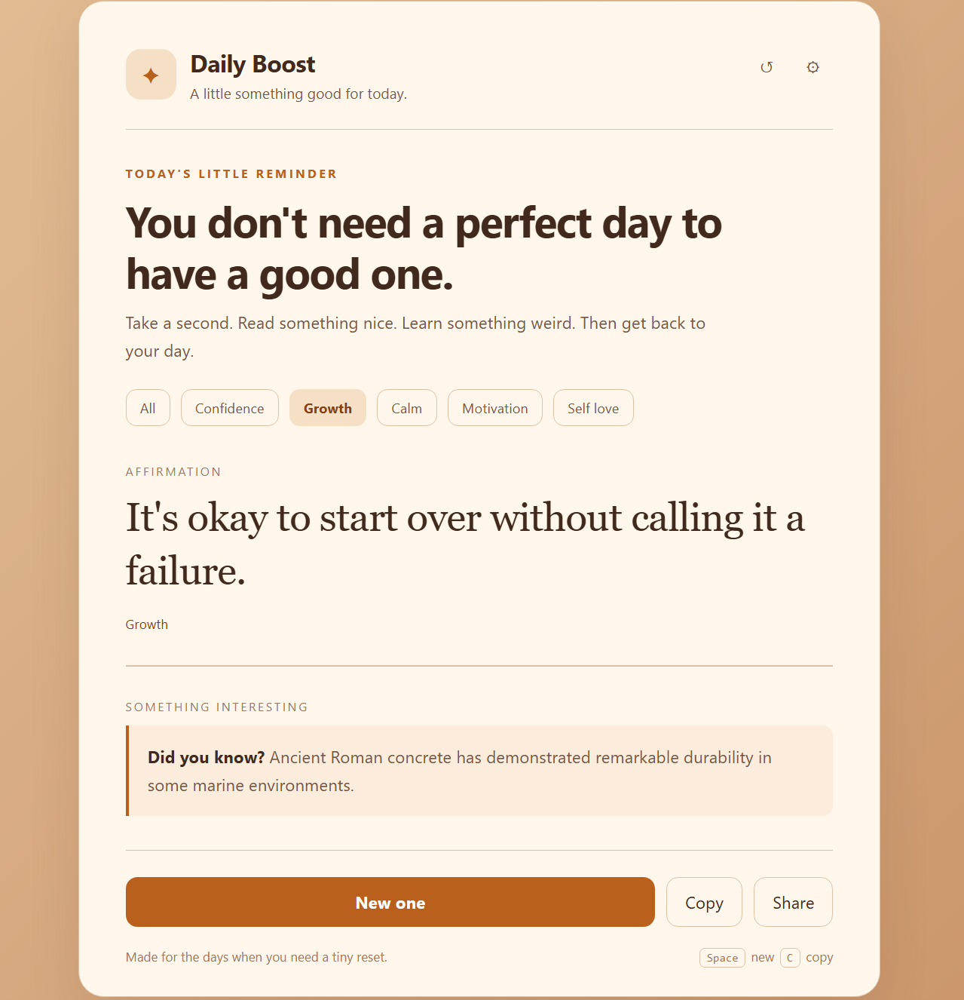

# ✨ Daily Boost

> A tiny corner of the internet for a little positivity, a random fact, and a quick reset.

Daily Boost is a lightweight, fully client-side web app that combines a daily affirmation with something interesting to learn. It is deliberately simple: open it, read something good, learn something weird, and get back to your day.

No backend. No account. No API key. No build process.

## 🌐 Live Demo


**[Live Demo](https://hosseinb1111.github.io/daily-boost/)**

## 📸 Preview





---

## ✨ Features

### 🌿 Daily affirmations

Get a fresh affirmation whenever you press **New one**.

Affirmations are organized into categories such as:

- Confidence
- Growth
- Calm
- Motivation
- Self Love

### 🧠 Interesting facts

Every affirmation is paired with a random fact covering subjects such as science, nature, space, animals, history, and the human body.

### 🎨 Multiple themes

The interface includes several visual styles:

- ☀️ Light
- 🌙 Dark
- 🏜️ Desert
- 🌊 Ocean
- 🌲 Forest
- 🌅 Sunset
- 💜 Lavender
- 🖤 AMOLED

The selected theme is remembered between visits.

### 📖 History

Generated combinations are stored locally so you can open the history panel and revisit things you saw earlier.

History is kept in the browser using `localStorage` and does not require an account or server.

### 📋 Copy

Copy the current affirmation and fact as a clean text block.

### 📤 Share

On supported browsers and devices, the app uses the native Web Share API. If native sharing is unavailable, it falls back to copying the content.

### ⏱️ Automatic refresh

Optional automatic generation can create a new combination every 30 seconds.

### 🎞️ Lightweight animations

Content changes use a small transition rather than heavy animation. Animations can also be disabled from Settings.

### 📳 Haptic feedback

Supported devices can provide a tiny vibration when actions are triggered.

### ⌨️ Keyboard shortcuts

| Key | Action |
|---|---|
| `Space` | Generate a new combination |
| `C` | Copy the current combination |


### ♿ Accessibility

The project includes basic accessibility considerations such as:

- `aria-label` attributes on icon buttons
- `aria-live` regions for generated content
- Keyboard-accessible controls
- Visible focus states
- Reduced-motion support through `prefers-reduced-motion`

### 📱 Responsive design

The layout adapts to desktop, tablet, and mobile screens without requiring a separate mobile application.

---

## 🛠️ Technologies

This project intentionally uses only browser-native technologies.

- **HTML5** — page structure and semantic markup
- **CSS3** — layout, themes, responsive design, animations
- **Vanilla JavaScript** — application logic and interactions
- **LocalStorage API** — saved theme, history, and preferences
- **Clipboard API** — copying generated content
- **Web Share API** — native sharing where supported
- **Vibration API** — optional haptic feedback where supported

There are no frameworks, packages, or external dependencies.

---

## 📁 Project Structure

```text
daily-boost/
│
├── index.html
├── README.md
└── screenshot.png       
```

The application currently lives in a single `index.html` file, which makes it very easy to host, edit, and experiment with.

---

## 🚀 Getting Started

### Run locally

No installation is required.

Clone the repository:

```bash
git clone https://github.com/hosseinb1111/daily-boost.git
cd daily-boost
```

Then open `index.html` in your browser.

For the best local-development experience, you can also use a simple local server.

With Python:

```bash
python -m http.server 8000
```

Then visit:

```text
http://localhost:8000
```

---

## ☁️ Deploying

Because the project is completely static, it works well with:

- GitHub Pages
- Netlify
- Vercel
- Cloudflare Pages
- Any normal static web host

### GitHub Pages

1. Create a GitHub repository.
2. Upload `index.html` and `README.md`.
3. Open **Settings → Pages**.
4. Select the main branch as the deployment source.
5. Save the settings.
6. GitHub will provide the public site URL.

---

## 🎨 Customization

The easiest way to personalize the project is through the CSS variables near the top of `index.html`.

For example:

```css
:root {
  --background: #f5f1e8;
  --background-2: #e9dfcf;
  --paper: #fffdf8;
  --text: #242321;
  --accent: #dc8427;
}
```

You can also add additional themes by creating another `[data-theme="..."]` block and adding a corresponding theme button.

### Adding affirmations

Affirmations are stored in the `affirmations` array:

```js
{
  text: "Your example affirmation goes here.",
  category: "growth"
}
```

### Adding facts

Facts are stored in the `facts` array:

```js
{
  text: "Your interesting fact goes here.",
  category: "science"
}
```

---

## 💾 Privacy

Daily Boost does not send your data to a server.

The following information can be stored locally in your browser:

- Selected theme
- Selected category
- Generated history
- Application preferences
- Current combination

Everything is handled through the browser's `localStorage` API.

Clearing the site's local storage or browser data will remove the saved information.

---

## ⚡ Performance

The app is intentionally small and dependency-free.

There are:

- No external JavaScript frameworks
- No external CSS libraries
- No remote API requests
- No tracking scripts
- No database
- No authentication
- No build step

This keeps the project quick to load and easy to understand.

---

## 🔒 Security

The project does not collect credentials or communicate with a backend.

Generated content is inserted into the page using DOM APIs rather than treating user-provided content as executable HTML.

Because this is a static client-side project, there is also no server-side database containing user information.

---

## 🧩 How It Works

The app keeps its state in a small JavaScript object and saves it to `localStorage`.

When a new combination is generated, the application:

1. Filters the available affirmations according to the selected category.
2. Chooses a random affirmation.
3. Chooses a random fact.
4. Avoids repeating the immediately previous combination where possible.
5. Updates the page using JavaScript.
6. Stores the generated item in local history.
7. Saves the updated state locally.

Because everything runs in the browser, the application can work offline after the page has been loaded.

---

## 🌍 Browser Support

Daily Boost is designed for modern browsers.

Core functionality works without any special browser features. Some optional features depend on browser support:

| Feature | Browser support requirement |
|---|---|
| Core app | Modern browser |
| Local storage | `localStorage` |
| Copy | Clipboard API, with fallback for older browsers |
| Share | Web Share API, where available |
| Haptic feedback | Vibration API, where available |
| Reduced motion | `prefers-reduced-motion` support |

---

## 🤝 Contributing

Contributions, ideas, and improvements are welcome.

A few useful directions for future improvements include:

- More affirmation categories
- More fact categories
- More themes
- A daily scheduled affirmation
- Optional multilingual content
- Better offline/PWA support
- Installable app support
- Custom user-created content

For larger changes, opening an issue first can make collaboration easier.

---

## 📜 License

This project is released under the **MIT License**.

See [`LICENSE`](./LICENSE) for the full license text.

---

## ❤️ Why This Exists

There are plenty of productivity apps that try to optimize every minute of your life.

This isn't one of them.

Daily Boost is meant to be much smaller than that. Sometimes you just need a good sentence, a weird fact, and a reason to keep moving.

Made with HTML, CSS, JavaScript, and a little bit of optimism.

---

## ⭐ Support the Project

If you enjoy the project, consider giving the repository a star on GitHub. It helps the project get discovered and is a nice way of saying, "this little thing was worth making."

---

**Built with vanilla web technologies. No framework. No backend. Just a small useful page.**
